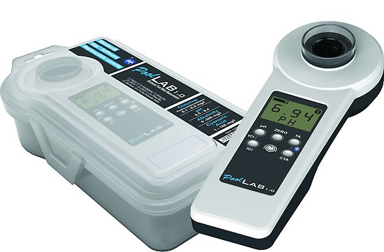
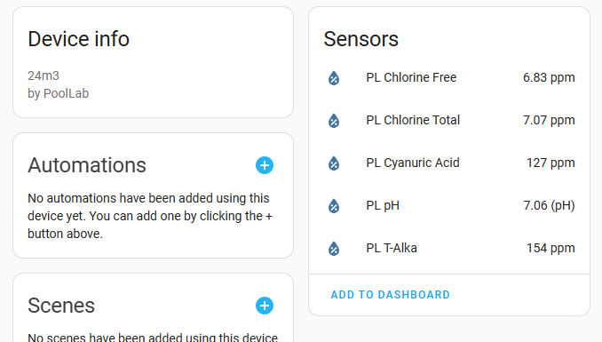

[](https://github.com/dala318/python_poollab/actions/workflows/hassfest.yaml)
[](https://github.com/dala318/python_poollab/actions/workflows/hacs.yaml)
[](https://github.com/dala318/python_poollab/actions/workflows/release.yaml)
[](https://github.com/dala318/python_poollab/actions/workflows/dependabot/dependabot-updates)


# Python PoolLab (Home Assistant)
Python API for Pool Lab Photometers. For now only fetching all data and parsing to classes.

## Home Assistant integration

### Install via HACS

> [!TIP]
> Python Poollab is available in the default HACS repository. You can install it directly through HACS or click the button below to open it there.

[](https://my.home-assistant.io/redirect/hacs_repository/?owner=dala318&repository=python_poollab)

_or_

1. Install HACS if you don't have it already
2. Open HACS in Home Assistant
3. Search for "Pool Lab"
4. Click the download button. ⬇️
5. Restart Home Assistant

### Configuration
1. Get a Pool Lab API token to your cloud data from https://labcom.cloud/pages/user-setting
2. Add the Pool Lab integration to your HA by clicking this My Home Assistant link: https://my.home-assistant.io/redirect/config_flow_start/?domain=poollab
   
   _or_
   
   Navigate to Home Assistant settings, "devices and integrations", click "Add integration" in the right bottom and select "Pool Lab"
3. In the configuration window enter the API token obtained in step 1
4. Each pool in your account should be shown as an own device which you can add to a room



### Entity attributes
Each sensor entity has the value of the last measurement of each parameter, based on the timestamp from device (not the one stored last)
In addition some attributes are provided:
* `Measured at`: The device timestamp at measure
* `Measure`: The unique id of the measure
* `Ideal low`: Lower limit for ok
* `Ideal high`: Upper limit for ok
* `Device serial`: Device serial of the device that made the measure
* `Operator name`: Mane of operator that did the measurement
* `Comment`: Comment to measurement


## Stand-alone usage
You only need the file [poollab.py](custom_components/poollab/poollab.py)

```python
from poollab import PoolLabApi
poollab_api = PoolLabApi("API_TOKEN_FROM_https://labcom.cloud/pages/user-setting")
print(asyncio.run(poollab_api.request()))
```
